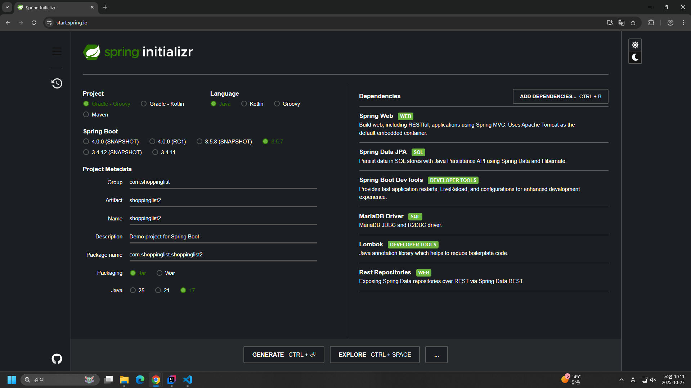

# 금일 수업 계획
1. shopping list 앱 backend 작성
2. todolist front 작성
  - 일부 바꿔서 OAuth2 적용 예정
  - backend 부분은 예제 파일 받아서 front 작성 부분 해 볼 예정

# 28일 오전 수업 후 오후 자습
  - 16:30 시험 관련 정보
# 이후 일정
  - 29일 시험
  - 30일 팀 공지 및 자리 배치 / 협업 툴 세팅 및 회의 + 회식
  - 31일 ~ 11월 6일 초기 프로젝트 기획안 작성
  - 11월 7일 발표

# Shoppinglist

http://localhost:8080/swagger-ui.html